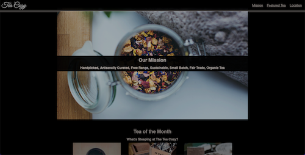
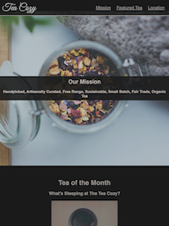

# teacozy

## Description

This website is is a practice of raw CSS. No framework is used. FLexbox and media queries are added to make the webpage responsive to different screen sizes. 

Here're screenshots of the project on PC and Tablet

## License

This project is under [MIT license](https://opensource.org/lsicenses/MIT).
